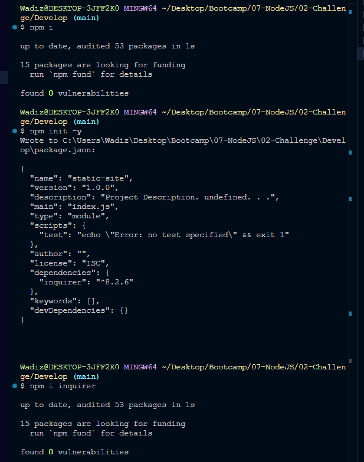

# README Creator 
  
## Description
This project is about creating a readme file in a simple and easy way. This will help us save time..
undefined.
This project helps me create a readme file that is very detailedBecause I am being asked detailed questions..
 My project is different because of the kinds of questions I am asking. .


## Installation
```
to install my project you will need npm i to install generic node packages. npm init -y will install a package.json file. npm i inquirer will install all the updated default packages. I have attached a photo and a video link on how to install the information.
```

https://drive.google.com/file/d/1Wnf6-mzokNbGyI5fZfTPguOvWXD7ntDK/view

## Usage
once you installed all the packages then you just need to know that answering these questions thoroughly will help create a very detailed README.  

## Credits
Zawadi Brown

## License
[](https://opensource.org/licenses/MIT)
This project is licensed under the MIT license.
https://opensource.org/licenses/MIT

## Features
My project creates a readme file just by answering questions. [picture of the feature](../Feature.png)

## How to Contribute
 the more questions you can add to this file the better it can become. 
